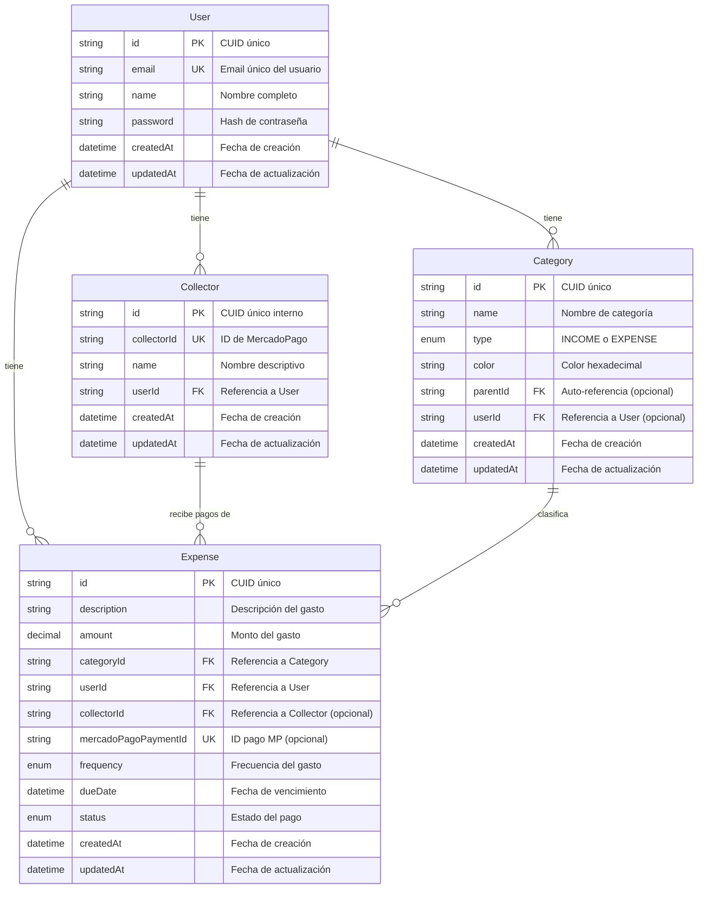

# Diagrama Entidad-Relación: Collectors y Tablas Relacionadas

## Diagrama Visual (Mermaid)



## Descripción de las Entidades

### 1. USER (Usuarios)
**Propósito**: Almacena la información de los usuarios del sistema.

| Campo | Tipo | Restricción | Descripción |
|-------|------|------------|-------------|
| id | String | PK | Identificador único CUID |
| email | String | UK, NOT NULL | Email único del usuario |
| name | String | NOT NULL | Nombre completo |
| password | String | NOT NULL | Hash de la contraseña |
| createdAt | DateTime | NOT NULL | Fecha de creación |
| updatedAt | DateTime | NOT NULL | Fecha de última actualización |

**Relaciones**:
- 1:N con Collector (un usuario tiene muchos collectors)
- 1:N con Expense (un usuario tiene muchos gastos)
- 1:N con Category (un usuario tiene muchas categorías)

---

### 2. COLLECTOR (Receptores de Pagos)
**Propósito**: Registra las entidades que reciben pagos desde MercadoPago.

| Campo | Tipo | Restricción | Descripción |
|-------|------|------------|-------------|
| id | String | PK | Identificador único interno CUID |
| collectorId | String | UK, NOT NULL | ID del collector en MercadoPago |
| name | String | NOT NULL | Nombre descriptivo del collector |
| userId | String | FK, NOT NULL | Referencia al usuario propietario |
| createdAt | DateTime | NOT NULL | Fecha de creación |
| updatedAt | DateTime | NOT NULL | Fecha de última actualización |

**Relaciones**:
- N:1 con User (muchos collectors pertenecen a un usuario)
- 1:N con Expense (un collector puede tener muchos gastos)

**Índices**:
- INDEX en userId (búsquedas por usuario)
- INDEX en collectorId (búsquedas por ID de MercadoPago)

---

### 3. EXPENSE (Gastos)
**Propósito**: Registra todos los gastos del usuario.

| Campo | Tipo | Restricción | Descripción |
|-------|------|------------|-------------|
| id | String | PK | Identificador único CUID |
| description | String | NOT NULL | Descripción del gasto |
| amount | Decimal | NOT NULL | Monto del gasto |
| categoryId | String | FK, NOT NULL | Categoría del gasto |
| userId | String | FK, NOT NULL | Usuario propietario |
| collectorId | String | FK, NULL | Collector (receptor del pago) |
| mercadoPagoPaymentId | String | UK, NULL | ID único de pago en MP |
| frequency | Enum | NOT NULL | MONTHLY, WEEKLY, etc. |
| dueDate | DateTime | NULL | Fecha de vencimiento |
| status | Enum | NOT NULL | PENDING, PAID, OVERDUE, PARTIAL |
| createdAt | DateTime | NOT NULL | Fecha de creación |
| updatedAt | DateTime | NOT NULL | Fecha de actualización |

**Relaciones**:
- N:1 con User (muchos gastos pertenecen a un usuario)
- N:1 con Category (muchos gastos tienen una categoría)
- N:1 con Collector (muchos gastos pueden ir a un collector)

**Índices**:
- INDEX en userId
- INDEX en dueDate
- INDEX en status
- INDEX en mercadoPagoPaymentId

---

### 4. CATEGORY (Categorías)
**Propósito**: Clasifica ingresos y gastos.

| Campo | Tipo | Restricción | Descripción |
|-------|------|------------|-------------|
| id | String | PK | Identificador único CUID |
| name | String | NOT NULL | Nombre de la categoría |
| type | Enum | NOT NULL | INCOME o EXPENSE |
| color | String | NULL | Color en formato hexadecimal |
| parentId | String | FK, NULL | Auto-referencia para jerarquía |
| userId | String | FK, NULL | NULL = categoría global |
| createdAt | DateTime | NOT NULL | Fecha de creación |
| updatedAt | DateTime | NOT NULL | Fecha de actualización |

**Relaciones**:
- N:1 con User (categorías personalizadas por usuario)
- 1:N con Expense (una categoría clasifica muchos gastos)
- Auto-referencia para categorías padre-hijo

**Índices**:
- INDEX en type
- INDEX en userId

---

## Cardinalidad de las Relaciones

### User ↔ Collector
- **Cardinalidad**: 1:N (Uno a Muchos)
- **Descripción**: Un usuario puede tener múltiples collectors, pero cada collector pertenece a un solo usuario
- **Obligatoriedad**: Un collector DEBE tener un usuario

### User ↔ Expense
- **Cardinalidad**: 1:N (Uno a Muchos)
- **Descripción**: Un usuario puede tener múltiples gastos
- **Obligatoriedad**: Un gasto DEBE tener un usuario

### Collector ↔ Expense
- **Cardinalidad**: 1:N (Uno a Muchos)
- **Descripción**: Un collector puede recibir múltiples pagos (gastos)
- **Obligatoriedad**: Un gasto PUEDE tener un collector (opcional)

### Category ↔ Expense
- **Cardinalidad**: 1:N (Uno a Muchos)
- **Descripción**: Una categoría puede clasificar múltiples gastos
- **Obligatoriedad**: Un gasto DEBE tener una categoría

### User ↔ Category
- **Cardinalidad**: 1:N (Uno a Muchos)
- **Descripción**: Un usuario puede crear múltiples categorías personalizadas
- **Obligatoriedad**: Una categoría PUEDE tener un usuario (NULL = global)

---

## Reglas de Negocio

### Integridad Referencial

1. **Eliminación en Cascada**:
   - Si se elimina un User → se eliminan sus Collectors, Expenses y Categories
   - Si se elimina un Collector → los Expenses mantienen el registro pero collectorId = NULL

2. **Unicidad**:
   - email en User debe ser único
   - collectorId (de MercadoPago) debe ser único en toda la tabla
   - mercadoPagoPaymentId debe ser único (evita duplicados)

3. **Validaciones**:
   - Un Collector no puede eliminarse si tiene Expenses asociados (validación a nivel aplicación)
   - Un gasto de MercadoPago debe tener collectorId
   - Las categorías globales (userId = NULL) no pueden ser modificadas por usuarios

---

## Flujo de Datos: Sincronización MercadoPago

```
MercadoPago API
     ↓
[Payment Data]
     ↓
┌─────────────┐
│  collector  │ → Extrae collector.id
│     .id     │
└─────────────┘
     ↓
[¿Existe Collector?]
     ↓ No
[Crear Collector]
     ↓ Sí
[Usar Collector existente]
     ↓
[Crear Expense con collectorId]
```

## Consultas SQL Típicas

### Obtener todos los collectors de un usuario
```sql
SELECT * FROM collectors 
WHERE userId = ? 
ORDER BY name ASC;
```

### Gastos por collector
```sql
SELECT 
    c.name as collector_name,
    COUNT(e.id) as total_gastos,
    SUM(e.amount) as monto_total
FROM collectors c
LEFT JOIN expenses e ON c.id = e.collectorId
WHERE c.userId = ?
GROUP BY c.id, c.name
ORDER BY monto_total DESC;
```

### Gastos con información completa
```sql
SELECT 
    e.*,
    c.name as collector_name,
    cat.name as category_name
FROM expenses e
LEFT JOIN collectors c ON e.collectorId = c.id
INNER JOIN categories cat ON e.categoryId = cat.id
WHERE e.userId = ?
ORDER BY e.dueDate DESC;
```

---

## Notas de Implementación

1. **Índices**: Críticos para performance en búsquedas frecuentes
2. **Collectors opcionales**: Gastos manuales pueden no tener collector
3. **Sincronización MP**: Auto-crea collectors al importar pagos
4. **Multi-tenancy**: Cada usuario ve solo sus propios datos
5. **Soft vs Hard Delete**: Considerar soft delete para collectors con historial